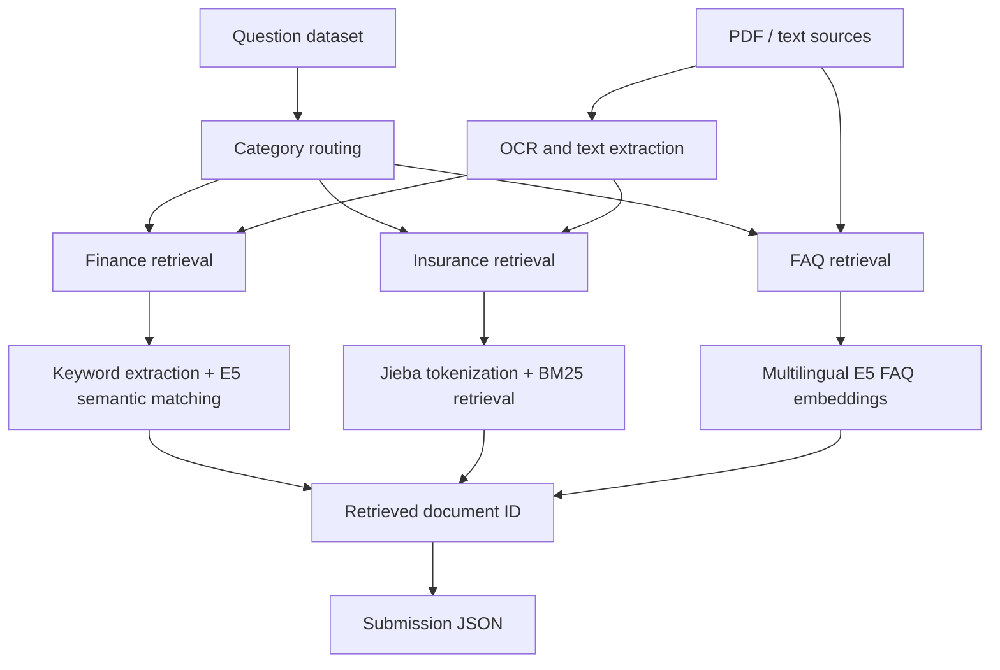

# AI CUP Financial QA Retrieval System

This repository contains a team competition project for financial document retrieval and question answering. The project was built for an AI CUP-style financial QA task, where the system needed to identify the most relevant source document for each question across financial, insurance, and FAQ datasets.

The codebase is kept as a competition prototype rather than a production service. It demonstrates document preprocessing, OCR-assisted text extraction, retrieval logic, and embedding-based semantic matching for Chinese financial QA scenarios.

## 中文摘要

本專案為金融問答檢索競賽的團隊作品，目標是根據題目內容，從金融、保險與 FAQ 文件中找出最相關的來源文件。專案包含 PDF/OCR 前處理、BM25 關鍵字檢索、multilingual E5 embedding 語意檢索，以及不同資料類型的檢索策略。

## Project Context

- **Task:** Retrieve the most relevant source document for each financial QA question.
- **Data types:** Finance documents, insurance PDFs, and FAQ knowledge content.
- **Approach:** Combine rule-based preprocessing, keyword retrieval, and semantic embedding retrieval.
- **Result:** Team competition project that can be referenced as a collaborative financial AI retrieval project.

## System Workflow



## Repository Structure

```text
.
├── Model/
│   ├── finance.py      # Finance document retrieval with keyword extraction and E5 embeddings
│   ├── insurance.py    # Insurance document retrieval with Jieba and BM25
│   └── FAQ.py          # FAQ semantic retrieval with multilingual E5 embeddings
├── Preprocess/
│   └── ocr.py          # PDF text extraction and OCR helper
├── requirements.txt
└── README.md
```

## Technical Stack

- Python
- OpenAI API for keyword extraction in the finance retrieval flow
- Hugging Face Transformers
- `intfloat/multilingual-e5-large`
- PyTorch
- Jieba
- BM25
- PyMuPDF, pdfplumber, pytesseract

## Setup

```bash
pip install -r requirements.txt
```

Copy `.env.example` to `.env` if you want to use the optional local environment variables:

```bash
OPENAI_API_KEY=your_openai_api_key
TESSERACT_PATH=C:\Program Files\Tesseract-OCR\tesseract.exe
OCR_INPUT_DIR=path\to\pdf_folder
```

Tesseract is required only for OCR-based PDF extraction.

## Example Usage

The scripts expect the competition dataset layout, including `questions.json` and category-specific source folders.

Finance retrieval:

```bash
python Model/finance.py \
  --question_path path/to/questions.json \
  --source_path path/to/source \
  --output_path path/to/output_finance.json
```

FAQ retrieval:

```bash
python Model/FAQ.py \
  --question_path path/to/questions.json \
  --source_path path/to/source \
  --output_path path/to/output_faq.json
```

Insurance retrieval:

```bash
python Model/insurance.py \
  --question_path path/to/questions.json \
  --source_path path/to/source \
  --output_path path/to/output_insurance.json
```

OCR preprocessing:

```bash
python Preprocess/ocr.py
```

Set `OCR_INPUT_DIR` before running the OCR helper.

## Notes and Limitations

- This is a competition-oriented prototype, not a deployed application.
- The dataset is not included in this repository.
- Some scripts assume the AI CUP dataset folder structure.
- Large intermediate files such as embeddings, logs, and generated outputs are intentionally ignored.
- Retrieval performance depends on source document quality, OCR quality, and hardware available for embedding inference.

## Portfolio Framing

This project is best understood as a collaborative financial AI retrieval system. It can support an Applied AI / AI Solutions Engineering portfolio by showing experience with:

- Financial document retrieval
- Domain-specific QA workflow design
- OCR and document preprocessing
- Hybrid retrieval strategies
- Embedding-based semantic matching
